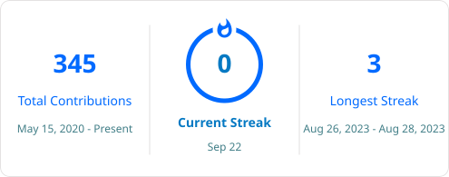

# Joshue Rogelio Garcia Butron

**Machine Learning & Computer Vision Engineer | MLOps · PyTorch · TensorRT · ONNX · CUDA · Kubernetes |**

Building tools for AI infrastructure, adversarial ML security, and visual systems.  
Currently engineering data pipelines at **NTT DATA** while building **GreyLayer** — offensive security tooling for LLMs and autonomous systems.

---

<table>
<tr>
<td width="50%" valign="top">

### 🔨 What I'm Building

**[FastAPI Doctor]([https://github.com/DavettoMX](https://github.com/DavettoMX/fastapi-doctor))** `WIP`  
Static analysis CLI for FastAPI & AI microservice backends. Domain-aware linting, anti-pattern detection, health scoring. No equivalent exists in the market.

**[Photo-Enforcement System](https://github.com/DavettoMX)** `WIP`  
End-to-end license plate recognition pipeline: image processing, OCR evaluation, infrastructure budgeting, and system quality framework for traffic enforcement.

**[Diagrams for AI Agents](https://github.com/DavettoMX)** `WIP`  
Visual diagram editor (ERD, UML, flowcharts) with MCP interface. Agents can read, propose, and manipulate designs without generating code. `.diagram` files version-controlled in Git.

**[Medical Image Diagnostic Assistant](https://github.com/DavettoMX)**
Vision-language system using LLaVA-Med that analyzes medical images (X-rays, MRI, anatomical diagrams) and responds to natural language queries about anomalies and diagnoses, producing structured diagnostic output.

**[Multimodal Document Analysis Assistant](https://github.com/DavettoMX)**
Multimodal document understanding system that processes scanned documents and text images using vision-language models, enabling natural language queries against visual content with structured information extraction.

</td>
<td width="50%" valign="top">

### 🧠 Core Stack

**Languages**  

**CV · Deep Learning · MLOps**  
  

**Infra · Cloud**  
  

**Backend · Databases**  

**More Tooling**
+ Podman · Helm
+ Spark · Airflow · Kafka · Databricks · MLflow
+ LangChain · LlamaIndex · vLLM · Qdrant · ChromaDB

</td>
</tr>
</table>

<table>
<tr>
<td width="33%" align="center" valign="top">

### 📺 Cuadrante Geek

Spanish-language YouTube channel.  
Tech analysis and criticism — no hype, no guru culture.

</td>
<td width="33%" align="center" valign="top">

### 🛡️ GreyLayer

Offensive security tools for LLMs and autonomous systems.  
Adversarial testing · Dataset poisoning detection · Pipeline auditing.

</td>
<td width="33%" align="center" valign="top">

### 🎓 Certifications

**eJPT** — Junior Penetration Tester (INE)  
**Cisco** — Security Analyst

</td>
</tr>
</table>

## ⚡️ Stats

<table>
<tr>
<td width="50%" rowspan="2" align="center">
  
</td>
<td width="50%" align="center">
  
</td>
</tr>
<tr>
<td align="center">
  
</td>
</tr>
</table>

